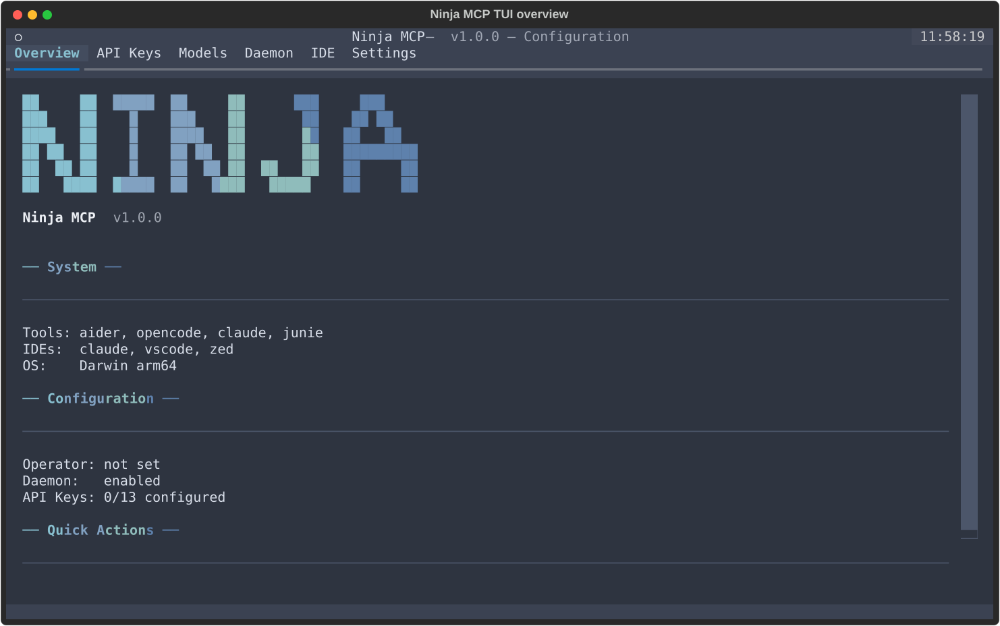
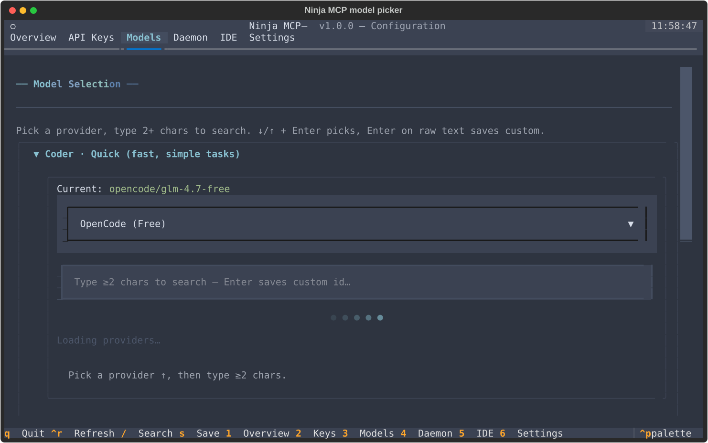
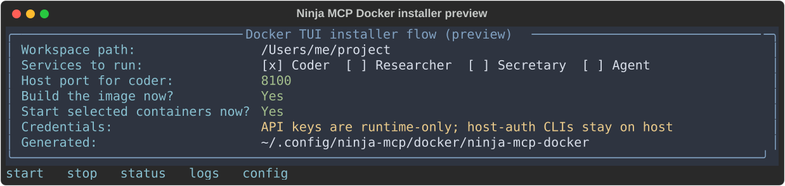

# Ninja MCP TUI

The current configuration UI is started with `ninja-mcp config` or
`ninja-config configure`. Initial setup uses `ninja-mcp config install` (also
available as `ninja-config install`). The old `ninja-config tui-install` name
is not a current entry point.

## Native Setup

```bash
ninja-mcp config install
ninja-mcp config configure
```

The installer can skip prompts for automation:

```bash
ninja-config install --skip-keys --skip-models
ninja-config install --non-interactive
```

Native configuration is written to `~/.ninja-mcp.env`; secrets use the OS
keyring when available and an encrypted-file fallback otherwise.

## Interface

The Textual configuration app uses the Nord palette and a six-row block-letter
NINJA logo. Tabs are Overview, API Keys, Models, Daemon, IDE, and Settings.
Digits `1` through `6` switch tabs. `q` quits, `s` saves, `/` focuses search,
and `Ctrl-R` refreshes. RU-layout bindings mirror the Latin `q`, `s`, and `/`
actions, so switching keyboard layouts is not required.

The Models tab has a provider selector and a per-role autocomplete input.
Provider discovery is lazy. After at least two typed characters, suggestions
are filtered from the cached provider list after a short debounce. Up/Down and
Enter select a suggestion; Enter on raw text saves a custom model id.





## Operators and Authentication

The TUI detects installed operators including `opencode`, `aider`, `claude`,
`gemini`, and `junie`. A host-authenticated operator does not need a duplicate
API key:

- Claude uses `claude auth status` and the existing Claude Code login.
- Junie uses JetBrains Account authentication and flat model ids such as
  `deepseek-v4-flash`.
- OpenCode uses its own provider configuration.

API-backed operators still need their provider credentials. The TUI does not
run a task just to probe authentication.

## Docker Setup

The Docker installer is part of the same flow. Run the normal installer and
choose `Docker container (isolated)` at the first prompt:

```bash
./install.sh
```

It asks for workspace, profiles, unique localhost ports, build/start choices,
and optional runtime credentials. It generates the Compose project under
`~/.config/ninja-mcp/docker` and provides the
`~/.local/bin/ninja-mcp-docker` wrapper.



See [Docker Quickstart](container-quickstart.md) for internal automation overrides,
profile behavior, volumes, and troubleshooting.
